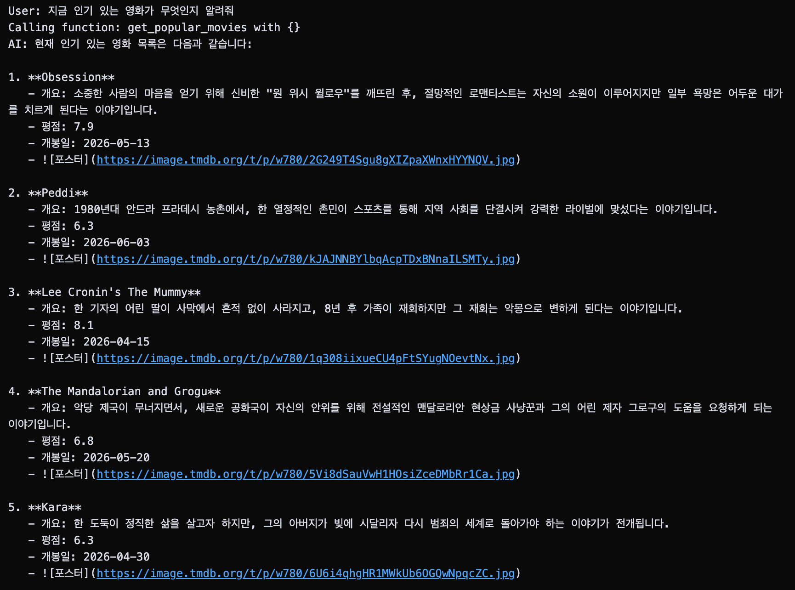
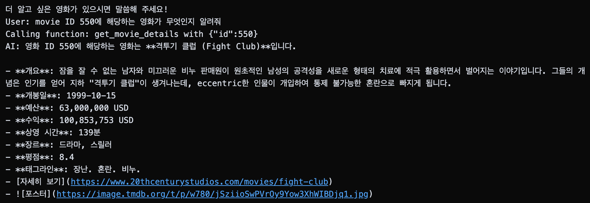
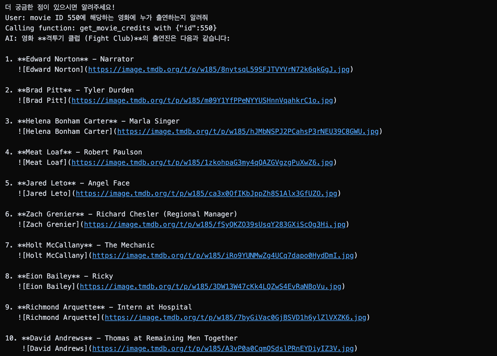
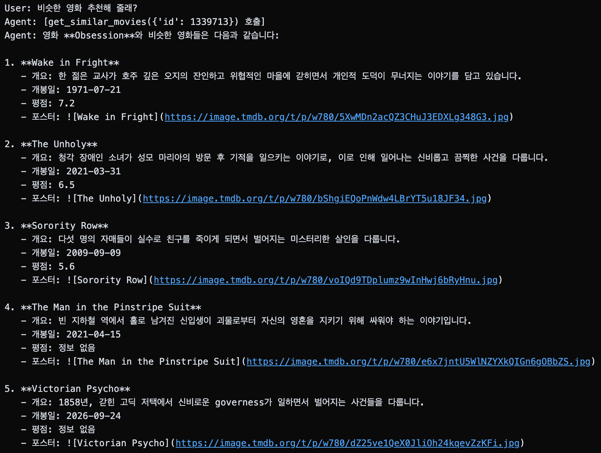

# 🎬 Movie Expert Agent

OpenAI GPT-4o-mini의 Function Calling 기능과 실제 Movie API를 활용하여 구현한 Movie Expert Agent입니다.

사용자의 자연어 질문을 분석하여 적절한 함수를 선택하고, 영화 정보를 조회하며, 사용자의 취향을 기억하여 개인화된 추천을 제공합니다.

---

## 📌 프로젝트 소개

이 프로젝트는 OpenAI Function Calling(Tool Calling)을 활용하여 사용자의 요청에 따라 적절한 영화 API를 호출하는 AI Agent를 구현한 프로젝트입니다.

단순한 영화 조회 기능뿐만 아니라 사용자의 선호 장르와 시청 이력을 기억하여 멀티턴 대화를 지원합니다.

### 주요 기능

* 현재 인기 영화 조회
* 영화 상세 정보 조회
* 영화 출연진 및 제작진 조회
* 유사 영화 추천
* 선호 장르 기억
* 시청한 영화 기억
* 대화 이력을 활용한 개인화 추천

---

## 🚀 사용 기술

* Python 3.12+
* OpenAI API
* GPT-4o-mini
* Requests
* Jupyter Notebook
* uv

---

## 📂 프로젝트 구조

```text
movie-expert-agent/
├── main.ipynb
├── README.md
├── pyproject.toml
├── uv.lock
├── .env
└── images/
```

---

## 🔗 Movie API

Base URL

```text
https://nomad-movies-2.nomadcoders.workers.dev
```

### API Endpoints

| Endpoint            | Description  |
| ------------------- | ------------ |
| /movies             | 인기 영화 조회     |
| /movies/:id         | 영화 상세 정보 조회  |
| /movies/:id/credits | 출연진 및 제작진 조회 |
| /movies/:id/similar | 유사 영화 조회     |

---

## 🛠 구현한 함수

### get_popular_movies()

현재 인기 영화 목록을 조회합니다.

```python
get_popular_movies()
```

---

### get_movie_details(id)

영화 ID를 이용하여 상세 정보를 조회합니다.

```python
get_movie_details(550)
```

---

### get_movie_credits(id)

영화 ID를 이용하여 출연진 및 제작진 정보를 조회합니다.

```python
get_movie_credits(550)
```

---

### get_similar_movies(id)

특정 영화와 유사한 영화를 조회합니다.

```python
get_similar_movies(550)
```

---

## 🧠 Memory 기능

사용자의 취향을 기억하기 위해 간단한 메모리 시스템을 구현했습니다.

### 저장되는 정보

```python
user_profile = {
    "favorite_genres": [],
    "watched_movies": []
}
```

### 메모리 함수

#### add_favorite_genre()

사용자가 좋아하는 장르를 저장합니다.

```python
add_favorite_genre("Sci-Fi")
```

#### add_watched_movie()

사용자가 이미 시청한 영화를 저장합니다.

```python
add_watched_movie("Interstellar")
```

#### get_user_profile()

저장된 사용자 정보를 조회합니다.

```python
get_user_profile()
```

---

## 🤖 Function Calling

Agent는 OpenAI Tool Calling을 사용하여 적절한 함수를 자동 선택합니다.

### 사용 가능한 Tools

```text
get_popular_movies()
get_movie_details(id)
get_movie_credits(id)
get_similar_movies(id)

add_favorite_genre(genre)
add_watched_movie(movie_title)
get_user_profile()
```

### 동작 흐름

```text
사용자 질문
    ↓
GPT 분석
    ↓
적절한 Tool 선택
    ↓
Movie API 호출
    ↓
Tool 결과 반환
    ↓
최종 응답 생성
```

---

## 💬 멀티턴 대화 예시

### 사용자 취향 저장

사용자

```text
나는 SF 영화를 좋아해
```

Tool Call

```python
add_favorite_genre("Sci-Fi")
```

---

### 시청 이력 저장

사용자

```text
인터스텔라 봤어
```

Tool Call

```python
add_watched_movie("Interstellar")
```

---

### 개인화 추천

사용자

```text
영화 추천해줘
```

Agent

```python
get_user_profile()
```

사용자의 취향과 시청 이력을 기반으로 추천 결과 생성

---

## 📋 테스트 결과

### Test 1 - 인기 영화 조회

#### Input

```text
지금 인기 있는 영화 알려줘
```

#### Tool Call

```json
{
  "name": "get_popular_movies",
  "arguments": {}
}
```

#### Result




### Test 2 - 영화 상세 조회

#### Input

```text
movie ID 550 정보 알려줘
```

#### Tool Call

```json
{
  "name": "get_movie_details",
  "arguments": {
    "id": 550
  }
}
```

#### Result




### Test 3 - 출연진 조회

#### Input

```text
movie ID 550 출연진 알려줘
```

#### Tool Call

```json
{
  "name": "get_movie_credits",
  "arguments": {
    "id": 550
  }
}
```

#### Result




### Test 4 - 유사 영화 추천

#### Input

```text
Fight Club과 비슷한 영화 추천해줘
```

#### Tool Call

```json
{
  "name": "get_similar_movies",
  "arguments": {
    "id": 550
  }
}
```

#### Result




## ✨ 구현 포인트

* OpenAI Function Calling 활용
* 제공된 API 호출
* Tool Call 처리 로직 구현
* Memory 기반 멀티턴 대화 지원
* 사용자 취향 저장 및 활용
* 개인화된 영화 추천 제공

---

## 👨‍💻 Author

안시우
